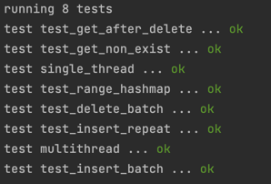
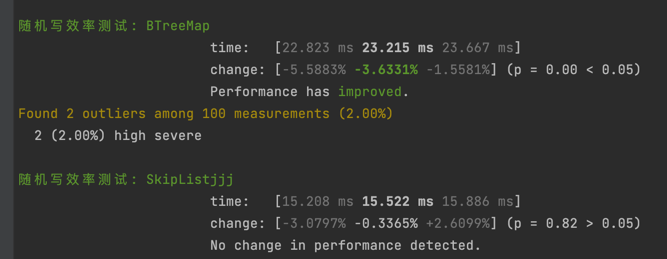
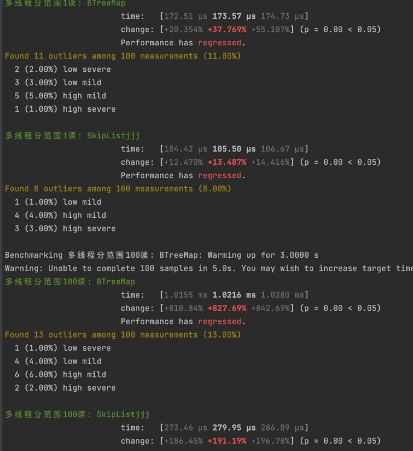
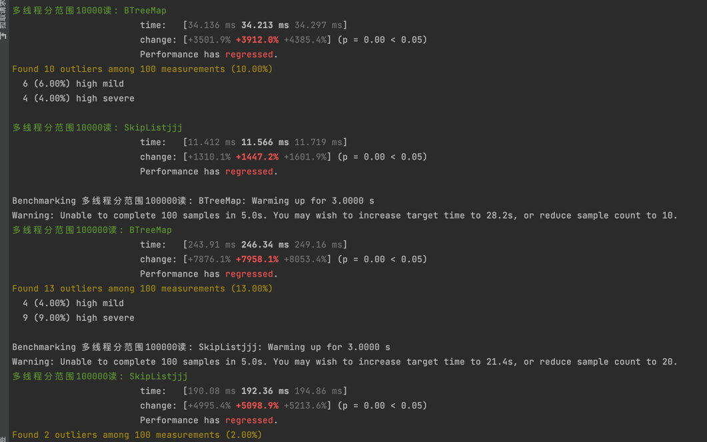
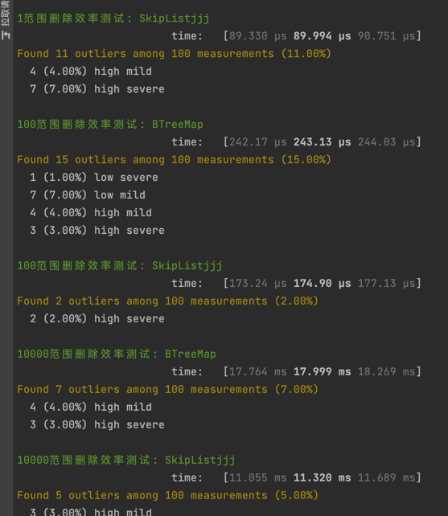

# rust_hackathon_kv

growonly，lockfree 并发skiplist实现

## test record

### 正确性测试

### 性能测试

我们实现的是无锁跳表，与b树+大锁做对比

多个线程插入顺序的key，此处我们的更快

多线程分范围随即写性能，此处速度比btree快

读性能大小范围都优于btree

删除性能由于删除后就没了，所以每次iter先insert然后删除
我们的跳表更快

